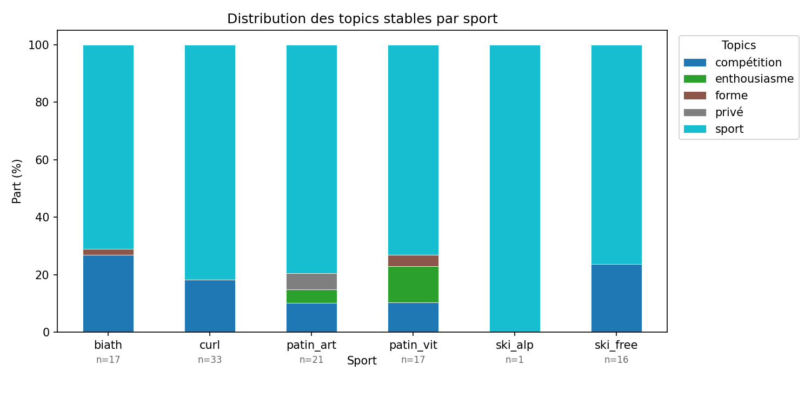
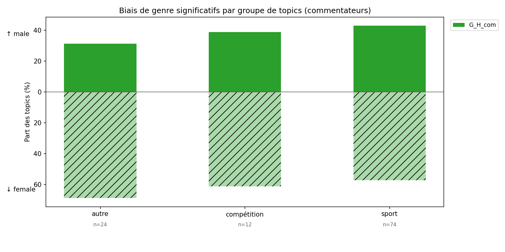

# Dérapage contrôlé — Étude des biais sexistes dans les commentaires sportifs des JO d'hiver Milan-Cortina 2026

> **Lucas Cumunel, Victor Le Lay, Quentin Mallegol**  
> Projet collectif coordonné par Roland Rathelot — encadrement Ivaylo Petev

---

## Vue d'ensemble

Ce projet mesure la prévalence de biais sexistes **latents** dans les commentaires sportifs en français diffusés lors des Jeux Olympiques d'hiver de Milan-Cortina 2026 (France Télévisions). L'analyse porte sur six sports, ~60 heures d'audio, ~44 000 phrases annotées avec le genre des journalistes et des athlètes.

Deux hypothèses sont testées :

- **H1** — Les thèmes abordés diffèrent selon le **genre de l'athlète** commenté.
- **H2** — Les thèmes diffèrent selon le **genre du journaliste**.

---

## Structure du dépôt

```
.
├── data_download.ipynb                    # Téléchargement des données
├── descriptive.ipynb                      # Statistiques descriptives & visualisations des résultats
├── transcription_diarization_genre.ipynb  # Conversion audio WAV → transcription + diarisation + genre
├── topic_modeling.ipynb                   # Topic modeling non-supervisé (BERTopic + CamemBERT)
├── dictionnaire.ipynb                     # Recherche de topics rares & dictionnaires thématiques
└──  cosinus.ipynb                         # Distances cosine selon le genre, travail exploratoire inachevé
 

```

---

## Reproduire les analyses


### Pipeline 1 — Analyse descriptive

Télécharge les données et génère les statistiques et graphiques descriptifs.

```
data_download.ipynb → descriptive.ipynb
```

| Notebook | Rôle |
|---|---|
| `data_download.ipynb` | Téléchargement et mise en forme des CSV bruts |
| `descriptive.ipynb` | Statistiques descriptives, distributions, visualisations |

---

### Pipeline 2 — Analyse thématique

Topic modeling non-supervisé puis recherche de topics rares via dictionnaires.

```
topic_modeling.ipynb → dictionnaire.ipynb
```

| Notebook | Rôle |
|---|---|
| `topic_modeling.ipynb` | BERTopic + embeddings CamemBERT, évaluation de stabilité par bootstrap |
| `dictionnaire.ipynb` | Dictionnaires thématiques issus de la littérature, calcul de fréquence et score d'intensité |

---

### Notebooks complémentaires

| Notebook | Rôle |
|---|---|
| `transcription_diarization_genre.ipynb` | Transcription des fichiers WAV, diarisation des locuteurs, détection du genre |
| `cosinus.ipynb` | Similarité cosine entre chaque phrase et des phrases-ancres thématiques (test de robustesse) |

---

## Méthode

### Corpus

- **Source** : France Télévisions (plateforme en ligne)
- **Sports** : biathlon, patinage artistique, patinage de vitesse, curling, ski alpin, ski freestyle
- **Volume** : ~60 h d'audio → ~44 000 phrases
- **Métadonnées** : genre du journaliste, genre de l'athlète commenté, sport, épreuve

Pour plus de détails sur le corpus, voir l'[annexe](output/Tables_et_figures.pdf).

### Approche bottom-up : BERTopic

1. **Embeddings** : `dangvantuan/sentence-camembert-base` (CamemBERT fine-tuné similarité sémantique)
2. **Réduction dimensionnelle** : UMAP
3. **Clustering** : HDBSCAN (pas de nombre de topics à fixer a priori ; phrases ambiguës → topic −1)
4. **Représentation** : c-TF-IDF pour identifier les mots discriminants de chaque cluster
5. **Seeding** : thèmes issus de la littérature injectés pour faciliter la comparaison bottom-up / top-down
6. **Stabilité** : bootstrap 10× sur 80% du corpus — topic retenu si Jaccard > 0.2 sur au moins 7 runs
7. **Labellisation** : manuelle, validée par trois annotateurs, fondée sur les thèmes de la littérature

**Labels utilisés** : `sport`, `compétition`, `enthousiasme`, `forme`, `émotion`, `effort`, `stratégie`, `privé`, `apparence`, `NA`

La significativité des écarts genrés est mesurée par la **Keyness** (log-likelihood) en comparant corpus féminin vs masculin pour H1 et H2.

### Approche top-down : dictionnaires thématiques

Thèmes issus de la littérature (Messner et al., 1993 ; Billings & Eastman, 2003 ; Fu et al., 2016 ; Yu & Shin, 2025 ; Syaputri et al., 2024…) :

| Thème | Description |
|---|---|
| Apparence physique | Commentaires sur le physique sans lien technique |
| Vie personnelle | Famille, entourage, biographie |
| Performance & héroïsme | Exploit, dépassement de soi |
| Résultats & enjeux | Scores, classements, qualification |
| Discours analytique | Lecture tactique, données chiffrées |
| Encouragement | Soutien verbal aux athlètes |
| Coopération / esprit d'équipe | Solidarité, collectif |
| Stratégie | Plans de course, lecture du jeu |
| Violence | Agression, contact physique |
| Personnalité | Traits de caractère |
| Chance | Aléa, fortune |

Deux métriques calculées par thème et par phrase :
- **Fréquence** : part de phrases contenant ≥ 1 terme du dictionnaire
- **Score d'intensité** : part des mots de la phrase appartenant au dictionnaire (∈ [0, 1])

**Tests de robustesse** : restriction aux phrases longues (> 13 mots, Q3), nettoyage des faux positifs, confirmation par similarité cosine (`cosinus.ipynb`).

---

## Principaux résultats

### Fréquence globale des thèmes

Le thème le plus fréquent est **résultats & enjeux** (17,7 % des phrases), suivi de l'encouragement (10,0 %), du discours analytique (9,2 %) et de la coopération (7,1 %). À l'inverse, **l'apparence physique est marginale (1,0 %)**, rupture nette avec la littérature antérieure sur la presse écrite. L'essentiel du corpus est composé de thèmes liés directement à l'action sportive.



### H1 — Genre de l'athlète

- Absence de biais systématique pour la majorité des topics.
- Les commentaires sont **plus factuels et centrés sur l'action** quand des femmes sont à l'écran.
- Les thèmes connexes (stratégie, forme physique) ou éloignés (émotion) sont davantage mobilisés pour les athlètes masculins.
- La **vie personnelle** est significativement surreprésentée pour les athlètes féminines (cohérent avec la littérature).
- La **performance & héroïsme** et les **résultats & enjeux** sont significativement surreprésentés pour les athlètes masculins.


### H2 — Genre du journaliste

- Les écarts sont **plus forts** que pour H1 (plus de topics biaisés, effets plus nets).
- Les commentatrices mobilisent davantage les thèmes hors cadre strictement sportif (émotion, vie privée, apparence).
- Les commentateurs masculins surreprésentent significativement la **performance**, les **résultats**, et le **discours analytique**.
- L'**encouragement** est, contre-intuitivement, davantage mobilisé par les commentateurs masculins.



### Variations par sport

| Sport | Signal notable |
|---|---|
| Curling | Forte surreprésentation masculine des résultats & enjeux (thème dominant à 22,2 %) |
| Patinage artistique | Vie personnelle nettement plus fréquente (9,0 %) ; intervalles larges |
| Patinage de vitesse | Discours analytique (17,0 %) et performance : fort signal chez les commentateurs masculins |
| Ski freestyle | Encouragement masculin particulièrement marqué |
| Ski alpin | Exception : performance & héroïsme surreprésentée pour les athlètes féminines |

---

## Références

- Messner et al. (1993) — sexisme structurel et explicite dans la couverture sportive
- Cooky et al. (2015) — *gender-bland sexism*, neutralisation de surface
- Billings & Eastman (2003) — apparence, performance, biais de genre
- Fu et al. (2016) — commentaires moins *game-related* pour les femmes
- Schmidt (2018) — vie personnelle et genre
- Yu & Shin (2025) — Keyness, marqueurs de genre unilatéraux
- Syaputri et al. (2024) — encouragement, analytique, coopération
- De Acutis et al. (2024) — effets des politiques de mixité

